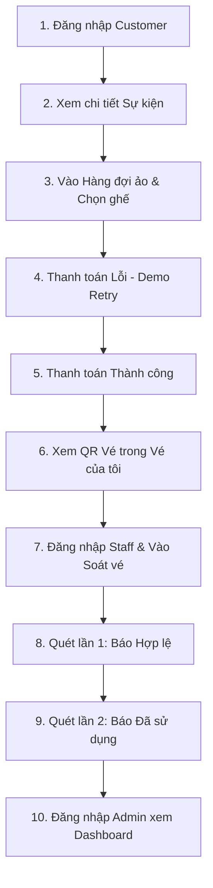

# Hệ thống Quản lý Sự kiện & Bán vé trực tuyến (Dề Dê Tickets)

**Mã đồ án:** ITPJ2602  
**Nhóm thực hiện:** SPRING  
**Lớp:** IS208.Q21  
**Khách hàng giả định:** Startup Dề Dê

---

## 1. Giới thiệu dự án & Mục tiêu hệ thống

**Dề Dê Tickets** là hệ thống quản lý sự kiện và phân phối vé trực tuyến, được thiết kế nhằm đáp ứng nhu cầu đặt vé thời gian thực (Real-time Booking) cho các sự kiện quy mô lớn (concert âm nhạc, workshop, hội thảo học thuật). Hệ thống tập trung tối ưu hóa trải nghiệm người dùng trong thời điểm mở bán vé cao điểm, đảm bảo tính công bằng và ổn định nhờ cơ chế hàng đợi ảo.

### Mục tiêu cốt lõi:
- **Đảm bảo tính nhất quán (Consistency):** Tuyệt đối chống tình trạng đặt trùng ghế (Double Booking) hoặc giữ ghế ảo quá hạn nhờ cơ chế khóa và tự giải phóng ghế.
- **Tính khả dụng cao (High Availability):** Sử dụng cơ chế hàng đợi ảo giảm tải cho cơ sở dữ liệu khi lượng truy cập đồng thời tăng đột biến.
- **Tiện ích và di động:** Thay thế ứng dụng soát vé di động native bằng giải pháp Web Responsive kết hợp mô phỏng Offline Scan tối ưu chi phí.

---

## 2. Công nghệ sử dụng

Hệ thống được xây dựng trên nền tảng công nghệ Java hiện đại, tối ưu hóa hiệu năng và kiến trúc bảo mật chặt chẽ:
- **Backend:** Spring Boot 3.4.x (Java 17)
- **Database:** Oracle Database (Oracle SQL & PL/SQL, JPA / Hibernate)
- **Frontend Engine:** Thymeleaf Template, Vanilla Javascript & Premium Vanilla CSS (thiết kế theo phong cách Glassmorphism hiện đại, responsive hoàn toàn)
- **Security:** Spring Security & Dynamic Role-Based Session Management
- **QR Engine:** Dynamic Hash QR generation cho vé điện tử

---

## 3. Cấu trúc thư mục dự án

```text
ticket-booking-system/
├── Database/                         # Chứa file script tạo bảng, trigger, và backup DB Oracle
├── src/
│   ├── main/
│   │   ├── java/com/dede/ticketsystem/
│   │   │   ├── config/              # Cấu hình hệ thống (Security, DataInitializer, v.v.)
│   │   │   ├── controller/          # Các REST controller và View controller 
│   │   │   ├── model/               # Các JPA Entity đại diện bảng trong DB Oracle
│   │   │   ├── repository/          # Tương tác dữ liệu với Spring Data JPA
│   │   │   └── service/             # Nghiệp vụ logic chính (Thanh toán, Vé, Giữ ghế, Hàng đợi)
│   │   └── resources/
│   │       ├── static/              # Các file static (CSS, JS, Images)
│   │       │   ├── css/
│   │       │   │   ├── main.css     # CSS toàn cục
│   │       │   │   └── pages/       # CSS riêng biệt cho từng trang nghiệp vụ
│   │       │   └── js/              # Các logic script soát vé, mua vé
│   │       └── templates/           # Giao diện Thymeleaf HTML chia theo phân hệ
│   │           ├── layout/
│   │           │   └── base.html    # Layout tổng thể (Navbar dynamic theo role, Footer)
│   │           ├── Public/          # Phân hệ Public & Khách hàng
│   │           ├── SoatVe/          # Phân hệ Soát vé Web Responsive dành cho Staff
│   │           ├── BaoCao/          # Phân hệ Báo cáo Dashboard Doanh thu
│   │           └── auth/            # Trang đăng ký / đăng nhập
│   └── test/                        # Unit test & Integration test
├── pom.xml                          # Quản lý thư viện Maven
└── README.md                        # Tài liệu hướng dẫn sử dụng và nộp đồ án
```

---

## 4. Cấu hình & Cách chạy ứng dụng

### 4.1 Cấu hình Oracle Database
Mở file `src/main/resources/application.properties` và cấu hình thông tin kết nối Database Oracle của bạn:
```properties
# Cấu hình Oracle Database
spring.datasource.url=jdbc:oracle:thin:@//localhost:1521/FREEPDB1
spring.datasource.driver-class-name=oracle.jdbc.OracleDriver
spring.datasource.username=DoAnQLDA
spring.datasource.password=123

# Cấu hình Hibernate cho Oracle
spring.jpa.database-platform=org.hibernate.dialect.OracleDialect
spring.jpa.hibernate.ddl-auto=update
spring.jpa.show-sql=true
spring.jpa.hibernate.naming.physical-strategy=org.hibernate.boot.model.naming.PhysicalNamingStrategyStandardImpl

# Cổng chạy ứng dụng
server.port=8080
```

### 4.2 Các lệnh thực thi
Chạy các lệnh sau tại thư mục gốc của dự án:
- **Biên dịch và đóng gói (Bỏ qua Unit Test):**
  ```bash
  mvn clean package -DskipTests
  ```
- **Khởi chạy ứng dụng:**
  ```bash
  mvn spring-boot:run
  ```

### 4.3 Reset database
Các script reset nằm trong `Database/99_reset/` và chỉ xóa dữ liệu, không drop table, constraint, index, function hoặc procedure.

- **Xóa toàn bộ data**:
  1. Mở Oracle SQL Developer.
  2. Đăng nhập bằng user/schema của ứng dụng.
  3. Chạy script:
  ```sql
  @Database/99_reset/reset_all_data.sql
  ```
  4. Restart app.

  `reset_all_data.sql` sẽ xóa toàn bộ user, role, sự kiện, khu vực, ghế, vé, đơn hàng, giao dịch và dữ liệu master/demo. Sau khi chạy xong, schema còn cấu trúc rỗng.

- **Chỉ xóa dữ liệu demo/runtime**:
  ```sql
  @Database/99_reset/reset_runtime_only.sql
  ```
  `reset_runtime_only.sql` chỉ xóa dữ liệu phát sinh khi demo như lịch sử soát vé, email log, giao dịch thanh toán, vé, đơn hàng, hàng đợi và log hành vi; user, role, sự kiện, khu vực và ghế được giữ lại.

- **Giữ database rỗng hoàn toàn sau khi restart app:**
  ```properties
  app.seed.enabled=false
  ```
- **Xóa data rồi để app seed lại dữ liệu mẫu sạch:**
  ```properties
  app.seed.enabled=true
  ```
- **Không tự động reset data mỗi lần chạy app:**
  ```properties
  app.dev.reset-data-on-start=false
  ```
  Mặc định của project là `false`. Chỉ bật `app.dev.reset-data-on-start=true` khi cần reset runtime lúc start app và đang chạy profile `dev` hoặc `local`.

---

## 5. Tài khoản & URL Demo chính

Hệ thống đã được tích hợp bộ dữ liệu mẫu thông minh qua **DataInitializer** (đảm bảo tính idempotent - tự động bỏ qua nếu dữ liệu đã tồn tại, tránh xung đột khóa ngoại).

### 5.1 Danh sách tài khoản demo (Mật khẩu chung: `123456`)
| Tài khoản | Vai trò (Role) | Chức năng chính |
| :--- | :--- | :--- |
| `admin` | **ADMIN** | Quản lý toàn quyền hệ thống, theo dõi doanh thu và báo cáo |
| `organizer` | **ORGANIZER** | Thiết lập sự kiện, điều phối và bán vé |
| `staff` | **STAFF** | Kiểm soát vé trực tiếp tại các cổng sự kiện |
| `customer` | **CUSTOMER** | Mua vé, thanh toán, quản lý vé cá nhân |

### 5.2 Các URL Demo quan trọng
- **`/`**: Trang chủ danh sách sự kiện (Public)
- **`/su-kien/{maSK}`**: Trang thông tin chi tiết sự kiện
- **`/mua-ve/{maSK}`**: Trang chọn ghế ngồi thời gian thực có chia khu vực (VIP/Standard)
- **`/thanh-toan?orderId=...`**: Trang thanh toán hóa đơn mô phỏng
- **`/ve-cua-toi`**: Kho lưu trữ vé đã mua kèm QR động (Khách hàng)
- **`/don-hang-cua-toi`**: Nhật ký đơn hàng đã giao dịch
- **`/soat-ve`**: Trang soát vé Web Responsive & Offline mô phỏng (Dành cho Staff/Admin)
- **`/baocao`**: Dashboard Báo cáo doanh thu & Thống kê ghế ngồi (Dành cho Admin/Organizer)
- **`/sukien`**: Quản lý sự kiện hành chính (Admin/Organizer)
- **`/donhang`**: Quản lý tất cả đơn hàng hệ thống (Admin/Organizer)
- **`/ve`**: Danh sách quản trị vé đã phát hành (Admin/Organizer)

---

## 6. Danh sách chức năng hoàn thành & Cơ chế mô phỏng

### 6.1 Các chức năng đã triển khai hoàn thiện:
1. **Quản lý phân quyền & Dynamic Navbar:** Hệ thống tự động thay đổi thanh điều hướng linh hoạt dựa trên quyền hạn đăng nhập thực tế của người dùng.
2. **Chọn ghế & Khóa giữ chỗ thời gian thực:** Ngăn chặn đặt trùng ghế. Hỗ trợ hiển thị 5 trạng thái ghế cực kỳ trực quan (Trống, Đang chọn, Đã bán, Bảo trì, Đang chọn bởi tôi).
3. **Hàng đợi ảo thông minh (Virtual Queue):** Sử dụng cơ chế token giới hạn lượt truy cập trang chọn ghế trong giờ cao điểm. Token có thời hạn sử dụng 1 lần (Single-use) để ngăn chặn spam.
4. **Retry thanh toán linh hoạt:** Khách hàng có thể thực hiện thanh toán lại nhiều lần nếu gặp lỗi mà không sợ bị hủy chỗ ngồi lập tức (giữ ghế trong 10 phút).
5. **Soát vé Responsive Web Scanner:** Nhân viên soát vé sử dụng camera điện thoại trực tiếp quét mã QR để đối soát hoặc nhập mã vé thủ công.
6. **Mô phỏng Offline Scan:** Cho phép nhân viên lưu trữ lịch sử quét vào `localStorage` của trình duyệt khi mất mạng, sau đó đồng bộ hóa thủ công hoặc tự động ngay khi khôi phục kết nối.
7. **Báo cáo và thống kê chuyên sâu:** Đồ thị phân tích doanh số sự kiện, tỷ lệ lấp đầy ghế ngồi theo thời gian thực.

### 6.2 Các ranh giới mô phỏng (Simulation Disclosures):
- **Payment Gateway:** Thanh toán qua ngân hàng được thực hiện giả lập. Giao dịch thành công/thất bại hoàn toàn do thao tác lựa chọn của người kiểm thử để dễ dàng demo.
- **Email Service:** Email gửi vé và thông tin đơn hàng được giả lập lưu trữ vào bảng `LICHSUGUI_EMAIL` trong cơ sở dữ liệu và ghi nhận trực tiếp ở tab terminal console log để tránh phụ thuộc vào server SMTP bên ngoài.
- **Mobile App soát vé:** Để tinh giản và tối ưu hóa vận hành, chức năng mobile app native của nhân viên soát vé được thay thế hoàn toàn bằng trang Web Responsive chạy mượt mà trên Safari/Chrome của điện thoại.
- **Tải trọng 10.000 User đồng thời:** Đây là tiêu chuẩn đo lường và định hướng thiết kế kiến trúc hàng đợi để mô phỏng kiểm thử hiệu năng, không đại diện cho hạ tầng phần cứng chạy thử nghiệm cục bộ hiện tại.
- **Logic nghiệp vụ SQL Procedure:** Ứng dụng demo sử dụng logic Spring Boot/JPA làm nguồn nghiệp vụ chính; các procedure SQL là tài liệu tham khảo/mô phỏng, không phải luồng runtime chính.

---

## 7. Checklist Demo 5 Phút (Step-by-step)

Vui lòng tuân thủ quy trình sau để trình diễn toàn bộ tinh hoa công nghệ của đồ án trong vòng 5 phút:



### Chi tiết các bước thực hiện:

- [ ] **Bước 1: Trải nghiệm Khách hàng (Mua vé & Thanh toán)**
  1. Truy cập `/dang-nhap` bằng tài khoản: `customer` / `123456`.
  2. Bấm vào trang chủ, chọn sự kiện **"Dề Dê Summer Concert 2026"**.
  3. Bấm nút **Đặt vé ngay**. Trình duyệt sẽ đưa bạn qua hàng đợi ảo (nếu quá tải) hoặc trực tiếp vào trang chọn ghế `/mua-ve/SK0001`.
  4. Tại sơ đồ ghế:
     - Chọn 1 ghế **Standard** (ví dụ hàng B) hoặc **VIP** (ví dụ hàng W). Bạn sẽ thấy ghế đổi màu sang trạng thái phát sáng xanh dương đại diện cho *Đang chọn bởi tôi*.
     - Bấm **TIẾP TỤC THANH TOÁN**.
  5. Hệ thống dẫn đến trang thanh toán giả lập có hiển thị thời gian đếm ngược 10 phút.
  6. **Demo Retry:** Bấm nút **THANH TOÁN THẤT BẠI** để mô phỏng lỗi thẻ/mất kết nối. Bạn sẽ được dẫn về trang đơn hàng của tôi kèm trạng thái *"Chờ thanh toán"*.
  7. Bấm nút **Thanh toán lại** trên dòng đơn hàng đó, tiếp tục bấm **THANH TOÁN THÀNH CÔNG**.
  8. Hệ thống xuất biên nhận. Truy cập menu **"Vé của tôi"** để chiêm ngưỡng mã QR động của vé vừa mua.

- [ ] **Bước 2: Trải nghiệm Nhân viên soát vé (Kiểm soát cổng)**
  1. Đăng xuất tài khoản khách hàng. Đăng nhập tài khoản: `staff` / `123456`.
  2. Truy cập menu **"Soát vé"** (`/soat-ve`).
  3. Sử dụng tính năng quét camera (nếu chạy trên thiết bị di động/camera webcam) HOẶC nhập trực tiếp mã vé/mã QR của vé vừa tạo ở Bước 1 vào ô nhập thủ công.
  4. **Quét lần 1:** Hệ thống phản hồi phát ra màu xanh lá sáng rực rỡ với dòng chữ **HỢP LỆ** chỉ trong vòng `< 1 giây` và lưu vào nhật ký. Trạng thái vé lập tức đổi thành `'Đã sử dụng'`.
  5. **Quét lần 2 (Mô phỏng gian lận/quét nhầm):** Thử quét lại mã QR đó một lần nữa. Hệ thống lập tức hiển thị cảnh báo màu vàng cam rực rỡ báo lỗi **VÉ ĐÃ SỬ DỤNG**, đồng thời ghi chú rõ thời gian quét hợp lệ lần đầu để nhân viên đối chiếu.

- [ ] **Bước 3: Trải nghiệm Ban quản lý (Báo cáo & Tổng quan)**
  1. Đăng xuất tài khoản nhân viên. Đăng nhập tài khoản: `admin` / `123456`.
  2. Truy cập menu **"Báo cáo"** (`/baocao`).
  3. Chiêm ngưỡng biểu đồ doanh thu tăng trưởng nhảy số tự động, thống kê tổng số vé bán ra và số lượng ghế trống cập nhật tự động theo các giao dịch thực hiện ở các bước trên.
